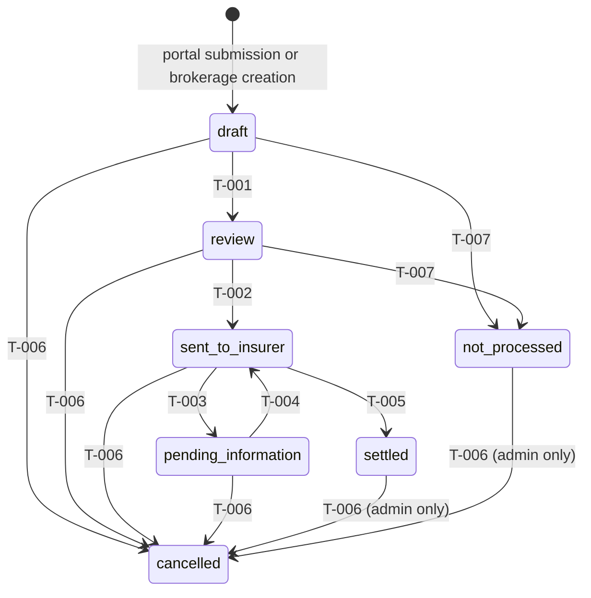

# State Machines & Transitions

> **Owns:** Every formal state, every transition (with a stable ID), who can trigger it, what it validates, and what side effects it fires.

## State machines

### Claim

The only state machine specified so far. Whether other entities get one is pending the domain model ([05-domain-model.md](05-domain-model.md)).

### States

| State | Meaning |
|-------|---------|
| `draft` | Just created, via portal submission or direct brokerage creation. Portal submissions hold a **snapshot** of insured/enrollment data until the brokerage links the real enrollment (D-018). |
| `review` | The brokerage completes and verifies the remaining claim data. Fixes happen here — there is no return to `draft` (D-019). |
| `sent_to_insurer` | With the insurer for adjudication. |
| `pending_information` | The insurer asked for additional information; the claim waits. Documents can be added here (D-012). |
| `settled` | Terminal*. The insurer gave a final outcome — paid in full, partial, or denied — recorded with amounts (D-013, D-017). |
| `not_processed` | Terminal*. Died before being sent to the insurer: abandoned, ineligible, duplicate (D-020). Reason required (D-023). |
| `cancelled` | Final. Administratively cancelled, with a required reason (D-016, D-021, D-023). |

\* "Terminal" except for T-006: even `settled` and `not_processed` can still be cancelled (D-016). `cancelled` is absolutely final.

### Transitions table

Cells hold **references**, not definitions: who-can-trigger lives in the permissions matrix, validations in business rules, side effects in notifications/jobs/audit.

| ID | From → To | Trigger (PERM refs, or "system") | Preconditions (BR refs) | Side effects (N / JOB / AUD refs) |
|----|-----------|----------------------------------|-------------------------|-----------------------------------|
| T-001 | `draft` → `review` | `claims-analyst`, `admin` _(PERM- TBD)_ | Claim linked to a real enrollment (D-018); BR-001 (service date within enrollment period); BR-002 (enrollment belongs to the claim's insured) | _(TBD)_ |
| T-002 | `review` → `sent_to_insurer` | `claims-analyst`, `admin` _(PERM- TBD)_ | Initial claim data complete — completeness rule to be defined _(BR- TBD)_ | _(TBD)_ |
| T-003 | `sent_to_insurer` → `pending_information` | `claims-analyst`, `admin` _(PERM- TBD)_ | — (records the insurer's information request) | _(TBD)_ |
| T-004 | `pending_information` → `sent_to_insurer` | `claims-analyst`, `admin` _(PERM- TBD)_ | Requested information received | _(TBD)_ |
| T-005 | `sent_to_insurer` → `settled` | `claims-analyst`, `admin` _(PERM- TBD)_ | Insurer final outcome (paid/partial/denied) and amounts recorded (D-013, D-017). Only from `sent_to_insurer` — never directly from `pending_information` (D-022) | _(TBD)_ |
| T-006 | any other state → `cancelled` | From active states: `claims-analyst`, `admin`. From `settled`/`not_processed`: `admin` only (D-021) _(PERM- TBD)_ | Reason required: category + optional note (D-023, D-026) | _(TBD)_ |
| T-007 | `draft`, `review` → `not_processed` (D-025) | `claims-analyst`, `admin` (D-025) _(PERM- TBD)_ | Reason required: category + optional note (D-023, D-026) | _(TBD)_ |

### Reason categories

Required by T-006 and T-007 (D-023, D-026, D-028); a free-text note may accompany any category. Extending a list is a decision-log event.

| Transition | Categories (v1) |
|------------|-----------------|
| T-006 (→ `cancelled`) | `withdrawn_by_claimant`, `duplicate`, `created_in_error`, `administrative` |
| T-007 (→ `not_processed`) | `ineligible`, `duplicate`, `abandoned`, `out_of_submission_window` |

`duplicate` appears in both lists deliberately, disambiguated by state (D-029): a duplicate discovered in `draft`/`review` **must** exit via T-007 (D-020); one discovered after sending exits via T-006, since T-007 is unavailable from those states (D-025). The claim's state determines the path — there is never a choice between the two.

### Diagram

## Open decisions
- [ ] What exactly makes "initial claim data complete" for T-002? (becomes a `BR-` rule; depends on the claim's field list in the domain model)
- [ ] Is there any limit on the T-003/T-004 loop count, or unlimited?
- [x] Define the reason category lists for cancellation and not-processed → see Reason categories (D-028)
- [ ] Cancelling a `settled` claim rewrites history — what happens downstream (dashboard counts, recorded amounts, audit)?
- [x] T-007 sources → restricted to `draft`/`review`; semantics win over the original "all non-terminal" statement (D-025)
- [x] Who triggers T-007? → `claims-analyst`, `admin` (D-025)
- [x] Cancellation / not-processed reasons → mandatory category + optional free-text note (D-026)
- [x] Which entities have state machines? → Claim, specified above; other entities pending the domain model
- [x] What ID format do transitions use? → `T-NNN`, per [00-conventions.md](../00-conventions.md)
- [x] Are any transitions automatic? → All seven are human-triggered as specified so far; the system enforces gates (e.g. BR-001) but never moves a claim by itself
- [x] Are any transitions reversible? → No backward transitions (D-019); the only loop is T-003/T-004, and cancellation is the escape hatch (D-016)
